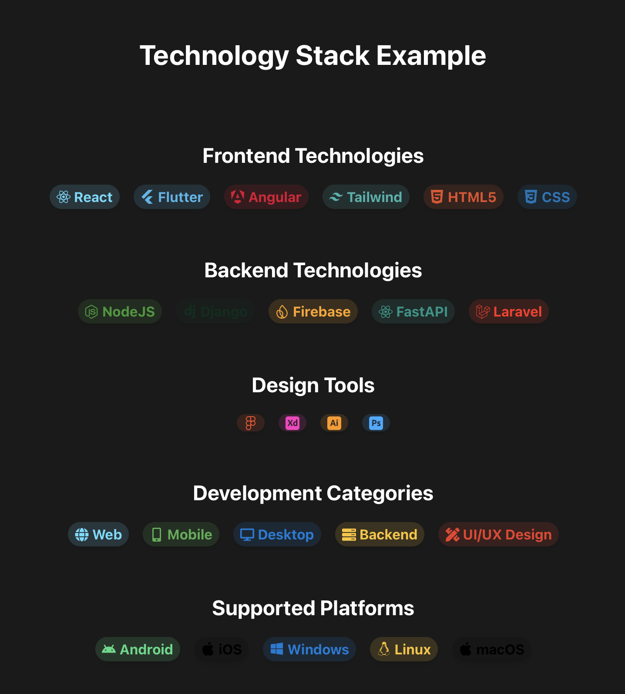
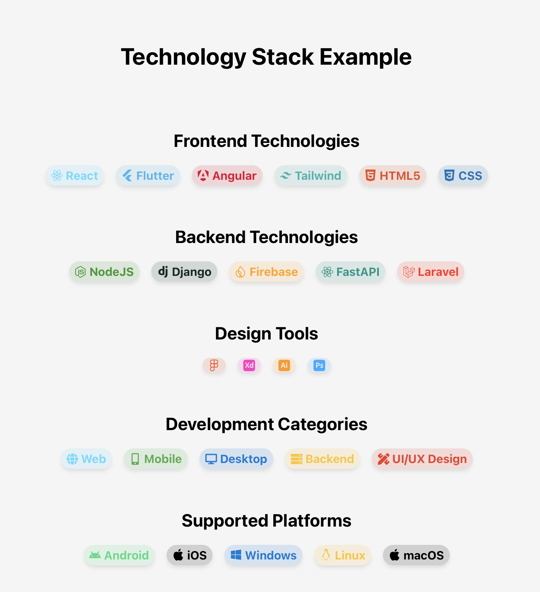

# Bixat Chip

[](https://github.com/bixat/bixat-chip/blob/main/LICENSE)
[](https://www.npmjs.com/package/bixat-chip)
[](https://github.com/bixat/bixat-chip/commits)

A modern, customizable React chip component for creating interactive social media links and tags with icons. Built with TypeScript and CSS for maximum flexibility and type safety.

## Features

- Fully customizable colors with auto-opacity
- Custom link support
- Clean CSS without framework dependencies
- TypeScript support
- Lightweight and performant

## Screenshots

### Dark Mode



### Light Mode



## Installation

```bash
npm install bixat-chip
# or
yarn add bixat-chip
```

```tsx
import { BixatChip, TagType, BixatTags } from 'bixat-chip';
import { FaGithub } from 'react-icons/fa';

const githubTag: TagType = {
  name: "GitHub",
  textColor: "#333333",
  icon: <FaGithub />,
  website: "https://github.com/bixat"
};

// Example usage of predefined tags
const predefinedTag = BixatTags.github;

function App() {
  return (
    <div>
      <BixatChip
        tag={githubTag}
        withTitle={true}
      />
      <BixatChip
        tag={predefinedTag}
        withTitle={true}
      />
    </div>
  );
}
```

## Props

| Prop | Type | Required | Description |
|------|------|----------|-------------|
| `tag` | `TagType` | Yes | Tag configuration object |
| `link?` | `string` | No | Custom link (overrides tag.website) |
| `withTitle` | `boolean` | Yes | Toggle title visibility |

### TagType Interface

```typescript
interface TagType {
    name: string;       // Tag display name
    textColor: string;  // HEX color code
    icon: ReactNode;    // React icon component
    website: string | undefined;  // Default URL
}
```

## Examples

```tsx
import { BixatChip, TagType } from 'bixat-chip';
import { FaGithub, FaTwitter, FaLinkedin } from 'react-icons/fa';

const socialLinks = () => {
  const tags: TagType[] = [
    {
      name: "GitHub",
      textColor: "#333333",
      icon: <FaGithub />,
      website: "https://github.com/bixat"
    },
    {
      name: "Twitter",
      textColor: "#1DA1F2",
      icon: <FaTwitter />,
      website: "https://twitter.com/bixat4dev"
    }
  ];

  return (
    <div style={{ display: 'flex', gap: '1rem' }}>
      {tags.map(tag => (
        <BixatChip 
          key={tag.name}
          tag={tag}
          withTitle={true}
        />
      ))}
    </div>
  );
};
```


## Customizing Styles

```css
.bixat-chip-link {
    /* Link styles */
}

.bixat-chip-container {
    /* Container styles */
}

.bixat-chip-icon {
    /* Icon styles */
}

.bixat-chip-title {
    /* Title styles */
}
```

## Development

### Clone the repository
```git clone https://github.com/bixat/bixat-chip.git```

### Install dependencies
```npm install```

### Build the component
```npm run build```

## Contributing

1. Fork the repository
2. Create your feature branch (`git checkout -b feature/add-tag`)
3. Commit your changes (`git commit -m 'Add amazing feature'`)
4. Push to the branch (`git push origin feature/add-tag`)
5. Open a Pull Request

## License

MIT © [Bixat.dev](https://bixat.dev)
